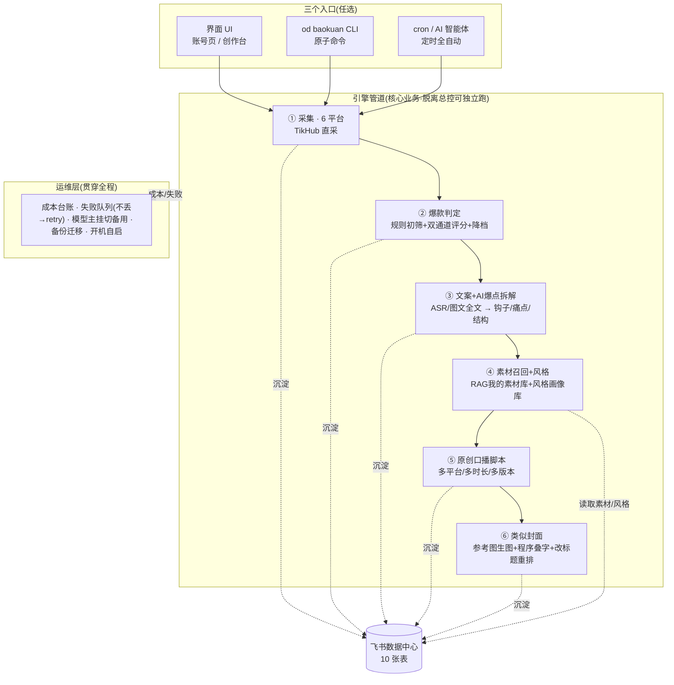
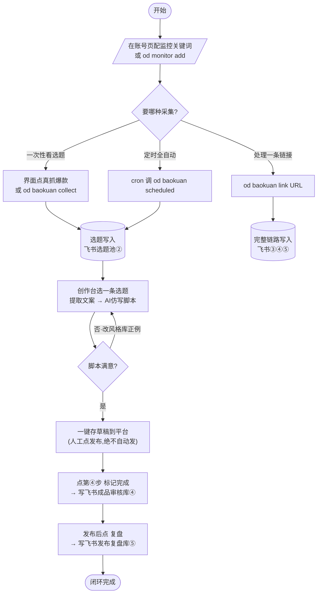
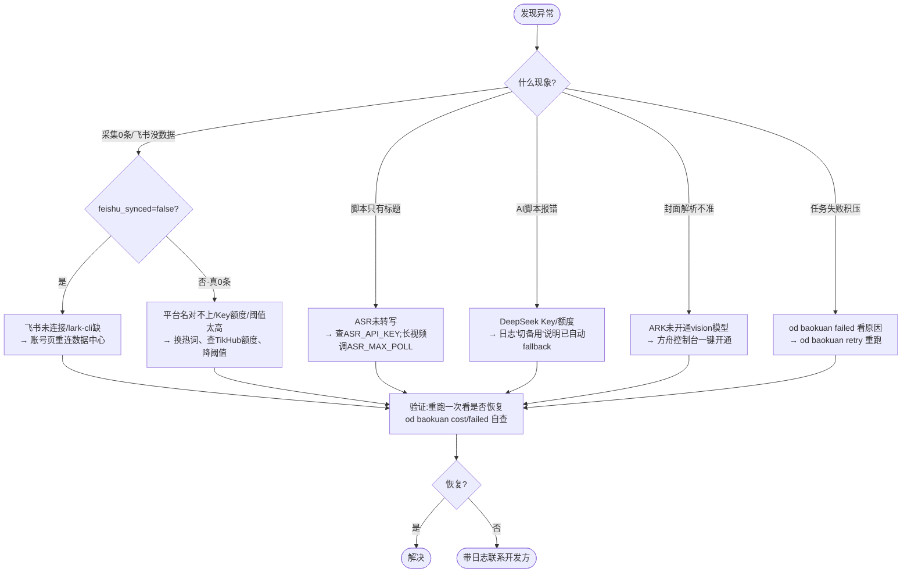
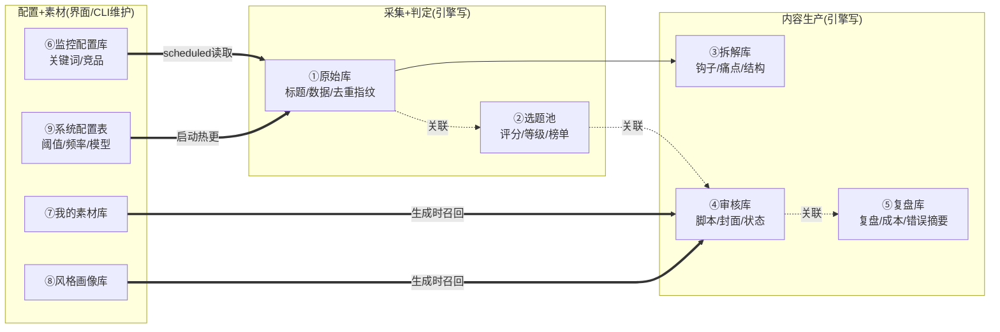

# 分层流程图(四类)· 爆创

> 遵循国标符号:圆角矩形=起止 · 矩形=操作 · 菱形=判断 · 平行四边形=数据/配置。
> 用 Mermaid 绘制,可在支持 Mermaid 的编辑器(Typora / VS Code+插件 / mermaid.live)直接渲染并
> **导出高清 PDF**。改了代码逻辑后同步改这里即可(与源码保持一致)。
> 节点编号与《从零搭建全流程手册》章节一一对应。

---

## 一、全流程总架构图

从三个入口驱动同一引擎管道,每步沉淀飞书,运维层贯穿全程。

---

## 二、章节分步流程图(日常使用主动线)

客户日常从"配监控 → 采集出选题 → 仿写脚本 → 存草稿 → 复盘"的最小操作路径。

---

## 三、关键卡点·故障复盘专项图

高频故障的"现象 → 日志定位 → 修复 → 验证"闭环(与《常见报错排查手册》对应)。

---

## 四、飞书表字段与关联流程图

10 张表的读写方向与双向关联(数据如何在表间流转)。

> 说明:实线=数据产出流向;点线=飞书双向关联字段(客户在飞书点一下即可跳转);粗线=引擎读取配置/素材。
> ⑩ Prompt与模型策略库为预留表(Prompt 仍在代码内,系统配置表⑨的「默认模型」已可在飞书改)。
